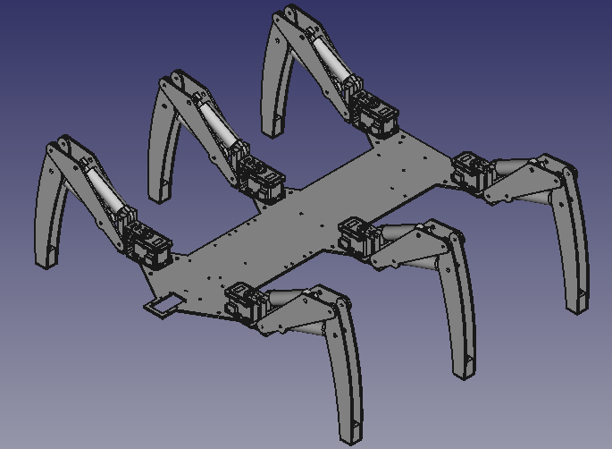
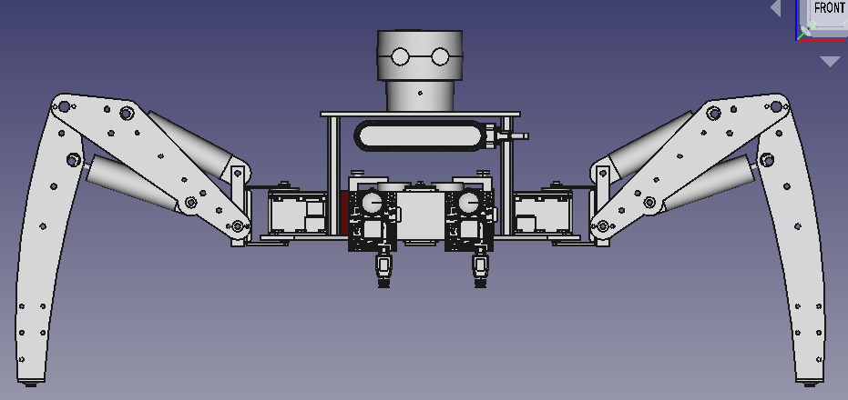
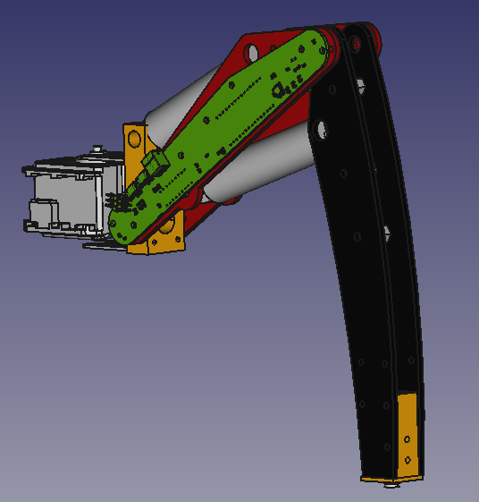
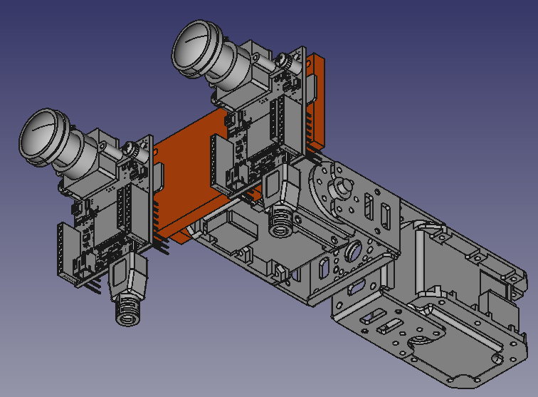
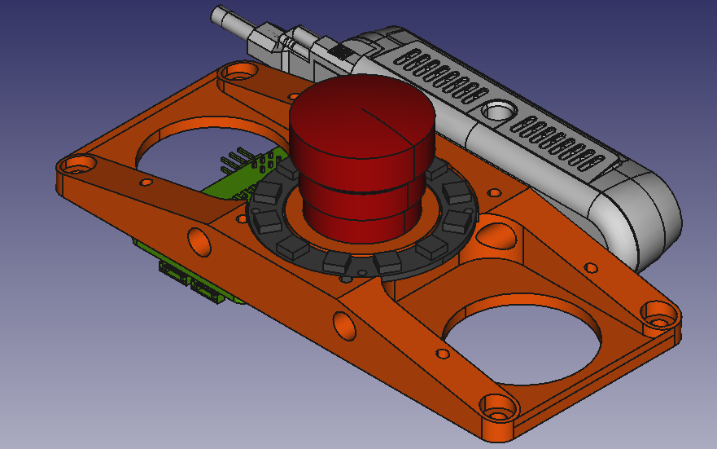

# L3X-Z Hexapod

Hexapod to participate at [ELROB 2022](https://www.elrob.org).

## overview





### leg



### pan tilt head



### upper deck




## block diagram
Central conmputing block is a Raspberry Pi 4 to which all other components connect:
```
Rasperry Pi 4
|-- USB
    |-- Colour Camera
    |-- Thermal Camera
    |-- Scanse Sweep
    |-- Intel Realsense D435i
    |-- WiFi Dongle (Internal Wifi probably too small range)
    |-- USB-2-RS485 (U2D2)
        |-- 6 x Dynamixel MX-28
        |-- (additional) 2 x Dynamixel MX-28 for pan tilt head
    |-- USB-2-RS232
        |-- Scanse Sweep LIDAR
        |-- KVH C-100 compass unit
    |-- Lynxmotion SSC-32 Servo controller for valves
    |-- USB-2-CAN (Babel) for UAVCAN
    |-- or SPI-2-CANFD for UAVCAN
        |-- 6 x Leg Controller Board (Arduino Nano 33 IoT)
           |-- 2 x AS5048A rotary angle sensor for femur/tibia rotation
           |-- 1 x Screw terminals for ground contact bumper switch
           |-- 1-2 LEDs
           |-- MCP2515 for connectivity via UAVCAN
        |-- radiation sensor
```

## software
  - ROS 1 (ROS Noetic Nim)

### uavcan

#### Node-IDs

| **Node-ID** | **device**                     |
|:-----------:|:------------------------------:|
| 1           | leg controller left front      |
| 2           | leg controller left middle     |
| 3           | leg controller left rear       |
| 4           | leg controller right front     |
| 5           | leg controller right middle    |
| 6           | leg controller right rear      |
| 50          | radiation detector             |
| 101         | aux controller (default value) |

## actuators
  - 6 x [Dynamixel MX-28AR](https://emanual.robotis.com/docs/en/dxl/mx/mx-28-2/) servo (RS485, for hip (coxa) rotation)
  - 1 x [U2D2](https://emanual.robotis.com/docs/en/parts/interface/u2d2/): USB to RS485 converter + power supply for MX-28AR 
  - 12 x [Leimbach 0H1650A Hydraulic Zylinder](http://leimbach-modellbau.de/Produkte/Hydraulik/Zylinder/0H16xxxA/) (femur and tibia)
  - [Lynxmotion SSC-32](http://www.lynxmotion.com/p-1032-ssc-32u-usb-servo-controller.aspx): servo controller for hydraulic valves.

## hydraulic components
  - 12 x [Leimbach 0H1650A Hydraulic Zylinder](http://leimbach-modellbau.de/Produkte/Hydraulik/Zylinder/0H16xxxA/) (femur and tibia)
  - 2 x [Leimbach 0H506A Standard Hydraulik-Ventile 6-fach](http://leimbach-modellbau.de/Produkte/Hydraulik/Ventile/0H50x/) 
  - 12 x [Leimbach 0H518F Servo FUTABA s3107 ( für Steuerventil )](http://leimbach-modellbau.de/Produkte/Elektronik/0H518F/) 
  - 1 x [Leimbach 0H108A Doppelpumpeneinheit M4](http://leimbach-modellbau.de/Produkte/Hydraulik/Pumpen/0H108(A)/) 

## sensors
  - 1 x [OpenMV Cam H7 R2](https://openmv.io/collections/cams/products/openmv-cam-h7-r2): Vision
  - 1 x [OpenMV Cam H7 R2](https://openmv.io/collections/cams/products/openmv-cam-h7-r2) + [FLIR Lepton Adapter Module](https://openmv.io/collections/cams/products/flir-lepton-adapter-module) + [FLIR Lepton](https://store.groupgets.com/products/flir-lepton-3-5): Thermal Vision
  - 1 x [Scanse Sweep](https://github.com/scanse/sweep-sdk): 360 ° LIDAR (SLAM/Mapping)
  - 12 x [AS5048A](https://ams.com/en/as5048a): 14-Bit rotary angle sensor for detecting position of femur/tibia
  - radiation sensor
  - 6 x [LAS4GQH-11/S](https://www.conrad.de/de/p/tru-components-las4gqh-11-s-drucktaster-220-v-dc-0-50-a-1-x-aus-ein-tastend-1-st-1661900.html): mechanical bumper switch at the foot endpoint to determine if the leg has ground contact
  - 1 x [Zubax Babel](https://zubax.com/products/babel): USB to CAN adapter, for UAVCAN communication
  - 1 x [KVH C-100](https://www.kvh.com/admin/products/compasses/compass-systems/c100-compass-engine) compass unit
  - 1 x radiation sensor
  - 1 x [Intel Realsense](https://www.intelrealsense.com/depth-camera-d435i) D435i

## connectivity
### WiFi
  - 1 x [Linksys WRT3200ACM-EU](https://openwrt.org/toh/linksys/wrt3200acm): Base Station
  - 1 x [ALFA AWUS036ACH](https://www.alfa.com.tw/products/awus036ach?variant=36473965871176): Robot

## related repositories
* https://github.com/107-systems/l3xz_openmv_camera (ROS driver for OpenMV cameras)
* https://github.com/107-systems/l3xz (Complete software for robot excl. camera driver)

* https://github.com/107-systems/107-Arduino-MCP2515
* https://github.com/107-systems/107-Arduino-AS504x
* https://github.com/107-systems/107-Arduino-UAVCAN
